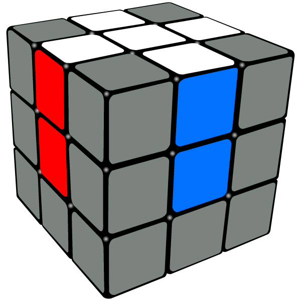

<!--
_class: intro-blue
_header: 
-->

# &nbsp;
# How to solve a Rubik's Cube

### Presented by: Tommy Falgout 

---

# Agenda

- Intro
- Facts + Faces + Notations
- Algorithms
- Next Steps

<!--
_footer: Credit https://ruwix.com/the-rubiks-cube/rubiks-cube-memes/
-->

---

# Me

- Learned how to solve ~10 years ago
- Coworker solved as "fidget toy"
- Took me ~1-2 weeks to solve
- ~1-2 months w/o instructions
- Color Blind (Deuteranomaly)

---

# Disclaimer

You will probably NOT solve a Rubik's Cube by the end of this session.

It takes time. And practice.  You will get frustrated. It is worth it.

- NOT a "smart people thing".  Anyone can.
- 8 algorithms to solve any Rubik's Cube
- "Speed-cubing" is black magic

<!--
_footer: Credit https://ruwix.com/the-rubiks-cube/rubiks-cube-memes/rubiks-cube-memes-page-3/
-->

---

# Fun Facts

* Erno Rubik 
  * Born in Budapest, Hungary during WWII
  * Studied sculpture in college
* Any cube can be solved in at least 20 moves
* 43 quintillion possible configurations
  * 43,252,003,274,489,856,000
  * 1 sec for each turn => 1400 trillion years
* 3x3 is typical size
  * 2x2, 4x4, 5x5 and beyond sizes

<!--
_footer: Credit https://www.theguardian.com/books/2020/sep/13/erno-rubik-the-cube-gives-me-hope-people-can-solve-their-problems-and-survive
-->

---

# Pieces

* centers (6 - immutable)
  * Reverse shell
  * White <-> Yellow
  * Blue <-> Green
  * Orange <-> Red
* corners (8)
* edges (12)

---

# Faces

* Up
* Down
* Left
* Right
* Front
* Back

R = Clockwise
R' = Counter Clockwise

<!--
_footer: Credit https://mzrg.com/rubik/mech.shtml
-->

---

# Notation 

### Screwtop
* Up + Up' (U + U')
* Down + Down' (D + D')

### Ferris Wheel

* Right + Right' (R + R')
* Left + Left' (L + L')

### Door Knob
* Front + Front' (F + F')
* Back + Back' (B + B')

---

# Algorithm

* D2 = (Perform Down twice)
* Multiple possible algos.  Will focus on beginners
* R U R' U'  -->

<!--
_footer: Credit https://www.cubelelo.com/blogs/cubing/how-to-solve-rubiks-cube
-->
---

# Phases

* Solve First Layer
* Solve Middle Layer
* Solve Final Layer

<!--
_footer: Credit https://www.youtube.com/watch?v=1t1OL2zN0LQ&pp=0gcJCdgAo7VqN5tD
-->

---

# Solve First Layer
1.) Make a daisy
2.) Make white cross with matched edges and center
3.) Solve the white corners

<!--
_footer: Credit https://www.learnhowtosolvearubikscube.com/how-to-solve-a-rubiks-cube-solution-overview
-->

---

# Solve Middle Layer

4.) Match the middle layer edges

<!--
_footer: Credit https://www.learnhowtosolvearubikscube.com/how-to-solve-a-rubiks-cube-solution-overview
-->

---

# Solve the Final Layer

5.) Make a yellow cross
6.) Orient the corners
7.) Position the yellow corners
8.) Position the yellow edges

<!--
_footer: Credit https://www.learnhowtosolvearubikscube.com/how-to-solve-a-rubiks-cube-solution-overview
-->

---

# Practice

* Chinese cubes are the best! (and cheapest)
  * Original Rubik's Cube are too stiff
  * Example: https://amzn.to/43G30rj (Amazon associate link)
  * 2x, 3x, 4x, 5x, Combo: https://amzn.to/4kjLlfZ 
* https://www.rubiks.com/solution-guides
  * YouTube videos (3m vids of each step) + PDF's

---
# Credit

* https://medium.com/swlh/how-i-learned-to-solve-the-rubiks-cube-in-30-seconds-afff9292b030
* https://how-to-solve-a-rubix-cube.com/
* https://www.cubelelo.com/blogs/cubing/how-to-solve-rubiks-cube
* https://www.learnhowtosolvearubikscube.com/how-to-solve-a-rubiks-cube-solution-overview
* https://www.reddit.com/r/Cubers/